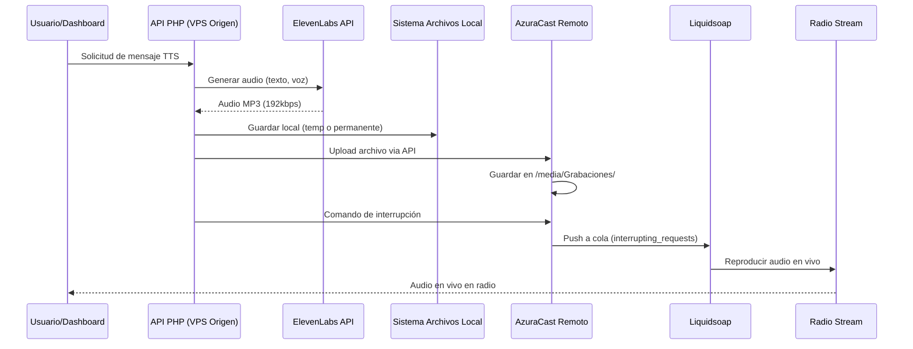

# Guía de Integración: Envío de TTS a AzuraCast Remoto

**Versión**: 1.0.0
**Fecha**: Enero 2025
**Estado**: Documentación Técnica para Implementación
**Autor**: Sistema Casa Costanera

---

## Tabla de Contenidos

1. [Resumen Ejecutivo](#resumen-ejecutivo)
2. [Arquitectura del Sistema](#arquitectura-del-sistema)
3. [Prerequisitos](#prerequisitos)
4. [Métodos de Integración](#métodos-de-integración)
5. [Implementación Paso a Paso](#implementación-paso-a-paso)
6. [Configuración de AzuraCast Remoto](#configuración-de-azuracast-remoto)
7. [Código de Referencia](#código-de-referencia)
8. [Testing y Validación](#testing-y-validación)
9. [Troubleshooting](#troubleshooting)
10. [Seguridad y Best Practices](#seguridad-y-best-practices)

---

## Resumen Ejecutivo

### Contexto Actual

El sistema Casa Costanera genera audio TTS (Text-to-Speech) perfectamente funcional mediante:
- **ElevenLabs API**: Genera audio de alta calidad (192kbps MP3)
- **Voces configuradas**: Rachel, Bella, Antoni, Josh, etc.
- **Base de datos SQLite**: Almacena metadata y programación
- **Sistema de archivos local**: Guarda los archivos MP3 generados

**LO QUE FALTA**: Enviar estos audios a una instalación de AzuraCast en otro VPS para que se reproduzcan en vivo.

### Solución Propuesta

Existen **DOS métodos** para enviar audio a AzuraCast remoto:

| Método | Ventaja | Desventaja | Caso de Uso |
|--------|---------|------------|-------------|
| **Interrupción (Interrupt)** | Control total, ejecución inmediata | Corta la música actual | Emergencias, anuncios urgentes |
| **Ducking** | Profesional, música de fondo | Más complejo técnicamente | Anuncios informativos normales |

### Stack Tecnológico

```
┌─────────────────────────────────────────────────────┐
│  VPS ORIGEN (Casa Costanera - 51.222.25.222)        │
│  - PHP 8.1                                           │
│  - Sistema TTS completo y funcional                  │
│  - Base de datos SQLite                              │
│  - Archivos MP3 generados                            │
└───────────────────┬─────────────────────────────────┘
                    │
                    │ HTTP/API + SSH/SCP
                    │
┌───────────────────▼─────────────────────────────────┐
│  VPS REMOTO (Radio Isla Negra - 51.91.252.76)       │
│  - AzuraCast (Docker)                                │
│  - Liquidsoap (Audio Engine)                         │
│  - Icecast (Streaming)                               │
│  - Estación ID: 4                                    │
└─────────────────────────────────────────────────────┘
```

---

## Arquitectura del Sistema

### Flujo Completo de Datos



### Componentes Clave

#### En VPS Origen (51.222.25.222)
- `/src/api/generate.php` - Generación de TTS
- `/src/api/services/radio-service.php` - Comunicación con AzuraCast
- `/src/api/services/tts-service-unified.php` - Abstracción de ElevenLabs
- `.env` - Configuración con credenciales remotas

#### En VPS Remoto (51.91.252.76)
- **AzuraCast Container**: Gestión de medios y API
- **Liquidsoap**: Motor de audio y colas
- **Media Storage**: `/var/azuracast/stations/[station]/media/Grabaciones/`
- **Liquidsoap Socket**: `/var/azuracast/stations/[station]/config/liquidsoap.sock`

---

## Prerequisitos

### En VPS Origen (donde está el TTS)

#### 1. Variables de Entorno
Asegurar que `.env` tenga la configuración remota:

```bash
# AzuraCast Remoto (Radio Test Isla Negra)
AZURACAST_REMOTE_URL="http://51.91.252.76"
AZURACAST_REMOTE_API_KEY="2fb35b3bcd180902:d040acd4a45cd7e813b7f9864a20dac7"
AZURACAST_REMOTE_STATION_ID=4
```

#### 2. Extensiones PHP Requeridas
```bash
php -m | grep -E "curl|json|fileinfo"
```

Deben estar instaladas:
- `curl` - Para llamadas HTTP a la API remota
- `json` - Para encoding/decoding de datos
- `fileinfo` - Para detección de tipos MIME

#### 3. Permisos de Red
```bash
# Test de conectividad
curl -I http://51.91.252.76/api/status

# Test de autenticación
curl -H "X-API-Key: 2fb35b3bcd180902:d040acd4a45cd7e813b7f9864a20dac7" \
     http://51.91.252.76/api/station/4/nowplaying
```

### En VPS Remoto (AzuraCast)

#### 1. API Key Activa
- Generar API Key con permisos de:
  - **Manage Station Media**
  - **Manage Station Broadcasting**

#### 2. Station ID
- Obtener el ID real de la estación:
```bash
curl -H "X-API-Key: YOUR_KEY" \
     http://51.91.252.76/api/stations | jq '.[] | {id, name}'
```

#### 3. Carpeta de Medios
- Crear carpeta `Grabaciones/` en la estación:
```bash
# Desde dentro del container
docker exec azuracast mkdir -p /var/azuracast/stations/[station_name]/media/Grabaciones
docker exec azuracast chown -R azuracast:azuracast /var/azuracast/stations/[station_name]/media/Grabaciones
```

#### 4. Liquidsoap Socket Accesible
```bash
# Verificar que el socket existe
docker exec azuracast ls -la /var/azuracast/stations/[station_name]/config/liquidsoap.sock
```

---

## Métodos de Integración

### Método 1: Interrupción Inmediata (RECOMENDADO PARA EMPEZAR)

**¿Cuándo usar?**
- Mensajes de emergencia
- Anuncios urgentes
- Testing inicial del sistema
- Cuando se necesita garantía de reproducción inmediata

**Cómo funciona:**
1. Genera TTS localmente
2. Sube archivo a AzuraCast vía API
3. Envía comando Liquidsoap `interrupting_requests.push`
4. La música se corta y el mensaje se reproduce inmediatamente
5. Después vuelve a la programación normal

**Ventajas:**
- Simple de implementar
- Garantía de reproducción
- Feedback inmediato

**Desventajas:**
- Corta la canción actual abruptamente
- Menos profesional para anuncios rutinarios

### Método 2: Ducking (Profesional)

**¿Cuándo usar?**
- Anuncios informativos regulares
- Promociones
- Mensajes no urgentes
- Cuando se busca calidad broadcast profesional

**Cómo funciona:**
1. Genera TTS localmente
2. Sube archivo a AzuraCast
3. Envía a cola especial de ducking
4. La música reduce su volumen a 20%
5. El mensaje se reproduce sobre la música
6. La música vuelve a volumen normal

**Ventajas:**
- Profesional y suave
- No interrumpe la música
- Mejor experiencia auditiva

**Desventajas:**
- Requiere configuración de Liquidsoap en el remoto
- Más complejo técnicamente
- Necesita ajuste de niveles de audio

---

## Implementación Paso a Paso

### PASO 1: Verificar Sistema TTS Local

```bash
# Probar generación de TTS
curl -X POST "http://localhost:4000/src/api/generate.php" \
  -H "Content-Type: application/json" \
  -d '{
    "text": "Este es un mensaje de prueba",
    "voice": "Rachel",
    "category": "informativos",
    "client_id": "casa"
  }'
```

**Respuesta esperada:**
```json
{
  "success": true,
  "id": 123,
  "file_path": "/var/www/casa/src/api/temp/tts20250107_143022.mp3",
  "filename": "tts20250107_143022_Rachel.mp3",
  "duration": 3.5
}
```

### PASO 2: Implementar Función de Upload

Crear o modificar `/src/api/services/radio-service.php`:

```php
<?php
/**
 * Upload archivo a AzuraCast Remoto
 * @param string $filepath Ruta local del archivo MP3
 * @param string $originalFilename Nombre descriptivo
 * @return array ['id' => int, 'filename' => string]
 */
function uploadToRemoteAzuraCast($filepath, $originalFilename) {
    // Cargar configuración remota
    $env = parse_ini_file('/var/www/casa/.env');
    $url = $env['AZURACAST_REMOTE_URL'] . '/api/station/' . $env['AZURACAST_REMOTE_STATION_ID'] . '/files';
    $apiKey = $env['AZURACAST_REMOTE_API_KEY'];

    // Nombre del archivo en el servidor remoto
    $timestamp = date('Ymd_His');
    $radioFilename = 'tts_' . $timestamp . '.mp3';
    $radioPath = 'Grabaciones/' . $radioFilename;

    // Leer y codificar archivo
    if (!file_exists($filepath)) {
        throw new Exception("Archivo no encontrado: $filepath");
    }

    $fileContent = file_get_contents($filepath);
    $base64Content = base64_encode($fileContent);

    // Payload de la API
    $data = [
        'path' => $radioPath,
        'file' => $base64Content
    ];

    // Log para debugging
    error_log("[RemoteUpload] Subiendo a: $url");
    error_log("[RemoteUpload] Ruta remota: $radioPath");
    error_log("[RemoteUpload] Tamaño: " . strlen($fileContent) . " bytes");

    // Ejecutar upload via cURL
    $ch = curl_init();
    curl_setopt_array($ch, [
        CURLOPT_URL => $url,
        CURLOPT_RETURNTRANSFER => true,
        CURLOPT_POST => true,
        CURLOPT_HTTPHEADER => [
            'Content-Type: application/json',
            'X-API-Key: ' . $apiKey
        ],
        CURLOPT_POSTFIELDS => json_encode($data),
        CURLOPT_TIMEOUT => 60
    ]);

    $response = curl_exec($ch);
    $httpCode = curl_getinfo($ch, CURLINFO_HTTP_CODE);
    $error = curl_error($ch);
    curl_close($ch);

    // Manejar errores
    if ($error) {
        throw new Exception("Error cURL: $error");
    }

    if ($httpCode !== 200) {
        error_log("[RemoteUpload] Error HTTP $httpCode: $response");
        throw new Exception("Error subiendo archivo: HTTP $httpCode");
    }

    // Parsear respuesta
    $responseData = json_decode($response, true);
    if (!$responseData || !isset($responseData['id'])) {
        throw new Exception("Respuesta inválida del servidor: $response");
    }

    error_log("[RemoteUpload] Upload exitoso! ID: " . $responseData['id']);

    return [
        'id' => $responseData['id'],
        'filename' => $radioFilename,
        'path' => $radioPath
    ];
}
?>
```

### PASO 3: Implementar Función de Interrupción Remota

Agregar al mismo archivo:

```php
<?php
/**
 * Interrumpe la radio remota con el archivo especificado
 * @param string $filename Nombre del archivo (ej: tts_20250107_143022.mp3)
 * @return array ['success' => bool, 'request_id' => string]
 */
function interruptRemoteRadio($filename) {
    $env = parse_ini_file('/var/www/casa/.env');
    $remoteUrl = $env['AZURACAST_REMOTE_URL'];
    $apiKey = $env['AZURACAST_REMOTE_API_KEY'];
    $stationId = $env['AZURACAST_REMOTE_STATION_ID'];

    error_log("[RemoteInterrupt] Interrumpiendo con: $filename");

    // OPCIÓN A: Via API de AzuraCast (MÁS PORTABLE)
    // Endpoint interno de Liquidsoap commands
    $url = "$remoteUrl/api/internal/$stationId/liquidsoap";

    // Construir URI del archivo
    // NOTA: Ajustar el path según el nombre real de la estación en el servidor remoto
    $fileUri = "file:///var/azuracast/stations/[STATION_NAME]/media/Grabaciones/" . $filename;

    $postData = [
        'command' => 'interrupting_requests.push',
        'arg' => $fileUri
    ];

    $ch = curl_init();
    curl_setopt_array($ch, [
        CURLOPT_URL => $url,
        CURLOPT_RETURNTRANSFER => true,
        CURLOPT_POST => true,
        CURLOPT_HTTPHEADER => [
            'X-API-Key: ' . $apiKey,
            'Content-Type: application/x-www-form-urlencoded'
        ],
        CURLOPT_POSTFIELDS => http_build_query($postData),
        CURLOPT_TIMEOUT => 30
    ]);

    $response = curl_exec($ch);
    $httpCode = curl_getinfo($ch, CURLINFO_HTTP_CODE);
    curl_close($ch);

    error_log("[RemoteInterrupt] Response HTTP $httpCode: $response");

    // OPCIÓN B: Via SSH (SI TIENES ACCESO SSH)
    // Más directo pero requiere configuración de claves SSH
    /*
    $sshHost = '51.91.252.76';
    $sshUser = 'root'; // o el usuario apropiado
    $command = sprintf(
        'docker exec azuracast bash -c \'echo "interrupting_requests.push %s" | socat - UNIX-CONNECT:/var/azuracast/stations/[STATION_NAME]/config/liquidsoap.sock\'',
        $fileUri
    );

    $sshCommand = sprintf('ssh %s@%s "%s"', $sshUser, $sshHost, addslashes($command));
    $output = shell_exec($sshCommand . ' 2>&1');
    */

    if ($httpCode === 200) {
        return [
            'success' => true,
            'request_id' => trim($response),
            'method' => 'api'
        ];
    }

    return [
        'success' => false,
        'error' => "HTTP $httpCode: $response",
        'method' => 'api'
    ];
}
?>
```

### PASO 4: Crear Endpoint Unificado

Crear `/src/api/remote-radio-service.php`:

```php
<?php
/**
 * Servicio para enviar TTS a AzuraCast Remoto
 * Endpoint unificado que genera TTS y lo envía a radio remota
 */

header('Content-Type: application/json');
header('Access-Control-Allow-Origin: *');
header('Access-Control-Allow-Methods: POST, OPTIONS');
header('Access-Control-Allow-Headers: Content-Type');

if ($_SERVER['REQUEST_METHOD'] === 'OPTIONS') {
    exit(0);
}

require_once __DIR__ . '/services/tts-service-unified.php';
require_once __DIR__ . '/services/radio-service.php';

// Logging
function logRemote($message) {
    $logFile = __DIR__ . '/logs/remote-radio-' . date('Y-m-d') . '.log';
    $timestamp = date('Y-m-d H:i:s');
    file_put_contents($logFile, "[$timestamp] $message\n", FILE_APPEND);
}

try {
    $input = json_decode(file_get_contents('php://input'), true);

    if (!$input) {
        throw new Exception('No se recibieron datos');
    }

    $action = $input['action'] ?? 'send';

    switch ($action) {
        case 'send':
            // Parámetros
            $text = $input['text'] ?? '';
            $voice = $input['voice'] ?? 'Rachel';
            $urgent = $input['urgent'] ?? true; // Por defecto, interrumpir

            if (empty($text)) {
                throw new Exception('El texto es requerido');
            }

            logRemote("=== INICIO: Envío a radio remota ===");
            logRemote("Texto: $text");
            logRemote("Voz: $voice");
            logRemote("Urgente: " . ($urgent ? 'SÍ' : 'NO'));

            // 1. Generar TTS
            logRemote("Paso 1: Generando TTS...");
            $audioData = generateEnhancedTTS($text, $voice, [
                'model' => 'eleven_multilingual_v2',
                'output_format' => 'mp3_44100_192'
            ]);

            if (!$audioData || strlen($audioData) < 1000) {
                throw new Exception('Error generando audio TTS');
            }

            // 2. Guardar temporalmente
            $tempFile = sys_get_temp_dir() . '/remote_tts_' . time() . '_' . rand(1000, 9999) . '.mp3';
            file_put_contents($tempFile, $audioData);
            logRemote("Paso 2: Audio guardado: $tempFile (" . filesize($tempFile) . " bytes)");

            // 3. Subir a AzuraCast remoto
            logRemote("Paso 3: Subiendo a AzuraCast remoto...");
            $uploadResult = uploadToRemoteAzuraCast($tempFile, null);
            logRemote("Upload exitoso! ID: {$uploadResult['id']}, Archivo: {$uploadResult['filename']}");

            // 4. Interrumpir radio (si es urgente)
            if ($urgent) {
                logRemote("Paso 4: Interrumpiendo radio...");
                $interruptResult = interruptRemoteRadio($uploadResult['filename']);
                logRemote("Resultado interrupción: " . json_encode($interruptResult));
            } else {
                logRemote("Paso 4: Skip (no urgente, archivo quedó en biblioteca)");
                $interruptResult = ['success' => true, 'message' => 'Archivo subido sin interrupción'];
            }

            // 5. Limpiar archivo temporal
            @unlink($tempFile);

            // 6. Respuesta
            logRemote("=== FIN: Éxito ===\n");

            echo json_encode([
                'success' => true,
                'data' => [
                    'text' => $text,
                    'voice' => $voice,
                    'azuracast' => $uploadResult,
                    'interruption' => $interruptResult,
                    'message' => $urgent ? 'Audio enviado e interrumpiendo radio' : 'Audio enviado a biblioteca'
                ]
            ], JSON_PRETTY_PRINT | JSON_UNESCAPED_UNICODE);
            break;

        case 'test':
            // Test rápido del sistema
            $testText = "Prueba del sistema de radio remota. Este mensaje debería interrumpir la radio.";

            // Recursión simple
            $_POST = json_encode([
                'action' => 'send',
                'text' => $testText,
                'voice' => 'Rachel',
                'urgent' => true
            ]);

            $input = json_decode($_POST, true);
            // ... (repetir lógica de 'send')

            break;

        default:
            throw new Exception("Acción no válida: $action");
    }

} catch (Exception $e) {
    logRemote("ERROR: " . $e->getMessage());

    http_response_code(500);
    echo json_encode([
        'success' => false,
        'error' => $e->getMessage()
    ], JSON_PRETTY_PRINT | JSON_UNESCAPED_UNICODE);
}
?>
```

### PASO 5: Testing Inicial

```bash
# Test 1: Verificar conectividad
curl -H "X-API-Key: 2fb35b3bcd180902:d040acd4a45cd7e813b7f9864a20dac7" \
     http://51.91.252.76/api/station/4/nowplaying

# Test 2: Enviar mensaje de prueba
curl -X POST "http://51.222.25.222:4000/src/api/remote-radio-service.php" \
  -H "Content-Type: application/json" \
  -d '{
    "action": "send",
    "text": "Atención, esta es una prueba del sistema de audio remoto",
    "voice": "Rachel",
    "urgent": true
  }'

# Test 3: Ver logs
tail -f /var/www/casa/src/api/logs/remote-radio-$(date +%Y-%m-%d).log
```

---

## Configuración de AzuraCast Remoto

### 1. Obtener Información de la Estación

```bash
# SSH al servidor remoto
ssh root@51.91.252.76

# Ver estaciones disponibles
docker exec azuracast azuracast stations:list

# Ejemplo de salida:
# ID    Short Name     Name
# --    ----------     ----
# 4     test          Radio Test Isla Negra
```

### 2. Configurar Carpetas de Medios

```bash
# Crear carpeta para TTS
docker exec azuracast mkdir -p /var/azuracast/stations/test/media/Grabaciones

# Ajustar permisos
docker exec azuracast chown -R azuracast:azuracast /var/azuracast/stations/test/media/Grabaciones

# Verificar
docker exec azuracast ls -la /var/azuracast/stations/test/media/
```

### 3. Verificar Liquidsoap Socket

```bash
# Verificar que el socket existe y es accesible
docker exec azuracast ls -la /var/azuracast/stations/test/config/liquidsoap.sock

# Debe mostrar algo como:
# srwxrwxrwx 1 azuracast azuracast 0 Jan  7 14:30 liquidsoap.sock
```

### 4. Test de Comandos Liquidsoap

```bash
# Test simple: obtener ayuda
docker exec azuracast bash -c \
  'echo "help" | socat - UNIX-CONNECT:/var/azuracast/stations/test/config/liquidsoap.sock'

# Listar colas disponibles
docker exec azuracast bash -c \
  'echo "request.list" | socat - UNIX-CONNECT:/var/azuracast/stations/test/config/liquidsoap.sock'

# Ver track actual
docker exec azuracast bash -c \
  'echo "request.on_air" | socat - UNIX-CONNECT:/var/azuracast/stations/test/config/liquidsoap.sock'
```

### 5. Configurar Liquidsoap para Ducking (OPCIONAL)

Si deseas implementar ducking en vez de interrupción, edita el archivo de configuración de Liquidsoap:

**Ubicación**: `/var/azuracast/stations/test/config/liquidsoap.liq`

**Agregar al final del archivo:**

```liquidsoap
# ========================================
# DUCKING SYSTEM PARA TTS
# ========================================

# Cola especial para TTS con ducking
tts_ducking_queue = request.queue(id="tts_ducking_queue")

# Limpiar silencios al inicio/final
tts_clean = blank.skip(
    threshold=-40.,
    max_blank=0.3,
    track_sensitive=false,
    tts_ducking_queue
)

# Amplificar TTS al 100%
tts_ready = amplify(1.0, tts_clean)

# Función de ducking: reduce música cuando hay TTS
def duck_level() =
  if source.is_ready(tts_ready) then
    0.2  # Música al 20% cuando hay TTS
  else
    1.0  # Música al 100% cuando no hay TTS
  end
end

# Aplicar ducking a la música
radio_ducked = amplify(duck_level, radio)

# Mezclar música duckeada con TTS
radio = add([radio_ducked, tts_ready])

# Logging
log("[DUCKING] Sistema de ducking activado")
```

**Reiniciar Liquidsoap:**
```bash
# Reiniciar estación desde AzuraCast UI
# O via CLI:
docker exec azuracast azuracast station:restart 4
```

---

## Código de Referencia

### Ejemplo Completo: Dashboard Integration

```javascript
// En el frontend del dashboard
async function sendToRemoteRadio(text, voice, urgent = true) {
    try {
        // Mostrar loading
        showNotification('Enviando mensaje a radio...', 'info');

        // Llamar al endpoint
        const response = await fetch('/src/api/remote-radio-service.php', {
            method: 'POST',
            headers: {
                'Content-Type': 'application/json'
            },
            body: JSON.stringify({
                action: 'send',
                text: text,
                voice: voice,
                urgent: urgent
            })
        });

        const data = await response.json();

        if (data.success) {
            showNotification(
                `¡Mensaje enviado exitosamente!
                 Archivo: ${data.data.azuracast.filename}
                 ${urgent ? 'Reproduciendo ahora en radio.' : 'Guardado en biblioteca.'}`,
                'success'
            );

            // Log para debugging
            console.log('Upload result:', data.data);

            return data.data;
        } else {
            throw new Error(data.error || 'Error desconocido');
        }

    } catch (error) {
        console.error('Error enviando a radio:', error);
        showNotification(`Error: ${error.message}`, 'error');
        return null;
    }
}

// Uso en el dashboard
document.getElementById('btnSendToRadio').addEventListener('click', async () => {
    const text = document.getElementById('messageText').value;
    const voice = document.getElementById('voiceSelect').value;
    const urgent = document.getElementById('urgentCheckbox').checked;

    if (!text.trim()) {
        alert('Por favor ingresa un mensaje');
        return;
    }

    await sendToRemoteRadio(text, voice, urgent);
});
```

### Script de Monitoreo

Crear `/var/www/casa/scripts/monitor-remote-radio.sh`:

```bash
#!/bin/bash
# Monitor de estado de radio remota

REMOTE_URL="http://51.91.252.76"
API_KEY="2fb35b3bcd180902:d040acd4a45cd7e813b7f9864a20dac7"
STATION_ID=4

echo "=== Monitor de Radio Remota ==="
echo ""

# 1. Estado de la estación
echo "1. Estado de la Estación:"
curl -s -H "X-API-Key: $API_KEY" \
     "$REMOTE_URL/api/station/$STATION_ID/status" | jq '.is_online, .listeners'

echo ""

# 2. Track actual
echo "2. Reproduciendo Ahora:"
curl -s -H "X-API-Key: $API_KEY" \
     "$REMOTE_URL/api/nowplaying/$STATION_ID" | jq '.now_playing.song | {title, artist}'

echo ""

# 3. Últimos archivos subidos
echo "3. Últimos Archivos en Grabaciones:"
ssh root@51.91.252.76 \
  "docker exec azuracast ls -lht /var/azuracast/stations/test/media/Grabaciones/ | head -10"

echo ""

# 4. Cola de Liquidsoap
echo "4. Cola de Requests:"
ssh root@51.91.252.76 \
  "docker exec azuracast bash -c 'echo \"request.list\" | socat - UNIX-CONNECT:/var/azuracast/stations/test/config/liquidsoap.sock'"
```

**Hacer ejecutable:**
```bash
chmod +x /var/www/casa/scripts/monitor-remote-radio.sh
```

---

## Testing y Validación

### Test 1: Conectividad Básica

```bash
# Ping al servidor
ping -c 3 51.91.252.76

# Test HTTP
curl -I http://51.91.252.76

# Test API con autenticación
curl -H "X-API-Key: 2fb35b3bcd180902:d040acd4a45cd7e813b7f9864a20dac7" \
     http://51.91.252.76/api/station/4/nowplaying
```

**Resultado esperado**: HTTP 200 con datos JSON de la estación

### Test 2: Upload de Archivo

```bash
# Crear un MP3 de prueba simple
php -r '
require_once "/var/www/casa/src/api/services/tts-service-unified.php";
$audio = generateEnhancedTTS("Prueba de upload", "Rachel");
file_put_contents("/tmp/test_upload.mp3", $audio);
echo "Archivo creado: /tmp/test_upload.mp3\n";
'

# Subir usando función de PHP
php -r '
require_once "/var/www/casa/src/api/services/radio-service.php";
$result = uploadToRemoteAzuraCast("/tmp/test_upload.mp3", "test_upload.mp3");
print_r($result);
'
```

**Resultado esperado**: Array con `id` y `filename`

### Test 3: Interrupción de Radio

```bash
# Usando el archivo subido en Test 2
php -r '
require_once "/var/www/casa/src/api/services/radio-service.php";
$result = interruptRemoteRadio("test_upload.mp3");
print_r($result);
'
```

**Resultado esperado**: `success => true` y el audio se reproduce en la radio

### Test 4: End-to-End Completo

```bash
curl -X POST "http://localhost:4000/src/api/remote-radio-service.php" \
  -H "Content-Type: application/json" \
  -d '{
    "action": "send",
    "text": "Atención visitantes, este es un anuncio de prueba del sistema automatizado",
    "voice": "Rachel",
    "urgent": true
  }' | jq '.'
```

**Resultado esperado**:
```json
{
  "success": true,
  "data": {
    "text": "Atención visitantes...",
    "voice": "Rachel",
    "azuracast": {
      "id": 12345,
      "filename": "tts_20250107_143022.mp3",
      "path": "Grabaciones/tts_20250107_143022.mp3"
    },
    "interruption": {
      "success": true,
      "request_id": "42",
      "method": "api"
    },
    "message": "Audio enviado e interrumpiendo radio"
  }
}
```

### Checklist de Validación

- [ ] TTS se genera correctamente localmente
- [ ] Archivo MP3 tiene tamaño > 1KB
- [ ] API remota responde con HTTP 200
- [ ] Upload retorna un `id` numérico
- [ ] Archivo aparece en carpeta remota `/media/Grabaciones/`
- [ ] Comando de interrupción retorna Request ID
- [ ] Audio se escucha en el stream de radio
- [ ] Log remoto muestra la ejecución correcta
- [ ] No hay errores en logs de PHP
- [ ] No hay errores en logs de Liquidsoap

---

## Troubleshooting

### Problema 1: "Connection refused" al llamar API remota

**Síntomas:**
```
curl: (7) Failed to connect to 51.91.252.76 port 80: Connection refused
```

**Causas posibles:**
1. Firewall bloqueando puerto 80/443
2. AzuraCast no está corriendo
3. Puerto configurado incorrectamente

**Soluciones:**
```bash
# En servidor remoto
# 1. Verificar que AzuraCast esté corriendo
docker ps | grep azuracast

# 2. Verificar puertos abiertos
netstat -tlnp | grep -E ':80|:443'

# 3. Revisar firewall
ufw status
iptables -L -n | grep -E '80|443'

# 4. Reiniciar AzuraCast si es necesario
cd /var/azuracast
docker-compose restart
```

### Problema 2: "Invalid API Key"

**Síntomas:**
```json
{
  "error": "Invalid API key provided",
  "code": 403
}
```

**Soluciones:**
```bash
# 1. Verificar API key en .env
grep AZURACAST_REMOTE_API_KEY /var/www/casa/.env

# 2. Generar nueva API key
# - Ir a AzuraCast UI: http://51.91.252.76
# - Administration → API Keys → New API Key
# - Copiar y actualizar en .env

# 3. Verificar permisos de la API key:
# Debe tener:
# - Manage Station Media
# - Manage Station Broadcasting
```

### Problema 3: Archivo sube pero no se reproduce

**Síntomas:**
- Upload exitoso (HTTP 200)
- Interrupción no retorna error
- Pero no se escucha en radio

**Diagnóstico:**
```bash
# SSH al servidor remoto
ssh root@51.91.252.76

# 1. Verificar que el archivo existe
docker exec azuracast ls -la /var/azuracast/stations/test/media/Grabaciones/ | tail -5

# 2. Verificar formato del archivo
docker exec azuracast file /var/azuracast/stations/test/media/Grabaciones/tts_*.mp3 | tail -1

# 3. Ver logs de Liquidsoap
docker exec azuracast tail -50 /var/azuracast/stations/test/config/liquidsoap.log | grep -i error

# 4. Probar comando manualmente
docker exec azuracast bash -c 'echo "interrupting_requests.push file:///var/azuracast/stations/test/media/Grabaciones/[ARCHIVO].mp3" | socat - UNIX-CONNECT:/var/azuracast/stations/test/config/liquidsoap.sock'
```

**Soluciones:**
1. Verificar que el path del archivo sea correcto (incluyendo nombre de estación)
2. Asegurar que el archivo sea un MP3 válido
3. Revisar permisos del archivo (debe ser readable por azuracast user)
4. Verificar que Liquidsoap tenga la cola `interrupting_requests` configurada

### Problema 4: "Nonexistent file or ill-formed URI"

**Síntomas:**
```
[liquidsoap] Error: Nonexistent file or ill-formed URI
```

**Causa:** Path incorrecto del archivo en el comando de Liquidsoap

**Solución:**
```bash
# 1. Obtener el nombre REAL de la estación
docker exec azuracast ls /var/azuracast/stations/

# Ejemplo de salida:
# test
# radio_1
# my_station

# 2. Actualizar el path en la función interruptRemoteRadio()
# Cambiar:
$fileUri = "file:///var/azuracast/stations/[STATION_NAME]/media/Grabaciones/" . $filename;

# Por (ejemplo si la estación se llama "test"):
$fileUri = "file:///var/azuracast/stations/test/media/Grabaciones/" . $filename;
```

### Problema 5: "Permission denied" al copiar archivo

**Síntomas:**
```
Error copiando archivo al contenedor: Permission denied
```

**Solución:**
```bash
# En servidor remoto
# 1. Ajustar permisos de carpeta
docker exec azuracast chown -R azuracast:azuracast /var/azuracast/stations/test/media/
docker exec azuracast chmod -R 775 /var/azuracast/stations/test/media/Grabaciones/

# 2. Verificar que el usuario de PHP tenga permisos de Docker
# (si estás copiando desde origen directamente via docker cp)
sudo usermod -a -G docker www-data
```

### Problema 6: Audio se corta o suena mal

**Síntomas:**
- Audio se reproduce pero suena entrecortado
- Se corta antes de terminar
- Hay ruido o distorsión

**Diagnóstico:**
```bash
# 1. Verificar bitrate del archivo
ffprobe /path/to/audio.mp3 2>&1 | grep -i bitrate

# 2. Verificar duración
ffprobe /path/to/audio.mp3 2>&1 | grep Duration

# 3. Verificar integridad
ffmpeg -v error -i /path/to/audio.mp3 -f null - 2>&1
```

**Soluciones:**
1. Asegurar que ElevenLabs genere audio a 192kbps mínimo
2. Verificar que el formato sea MP3 (no AAC u otro)
3. Asegurar que el sample rate sea 44100 Hz
4. Verificar que no haya problemas de red durante el upload

### Logs Importantes

```bash
# En VPS Origen
tail -f /var/www/casa/src/api/logs/remote-radio-$(date +%Y-%m-%d).log
tail -f /var/www/casa/src/api/logs/tts-$(date +%Y-%m-%d).log

# En VPS Remoto (via SSH)
ssh root@51.91.252.76 "docker exec azuracast tail -f /var/azuracast/stations/test/config/liquidsoap.log"
ssh root@51.91.252.76 "docker logs -f azuracast --tail 100"
```

---

## Seguridad y Best Practices

### 1. Protección de API Keys

**NUNCA hardcodear API keys en código:**

```php
// ❌ MAL
$apiKey = "2fb35b3bcd180902:d040acd4a45cd7e813b7f9864a20dac7";

// ✅ BIEN
$env = parse_ini_file('/var/www/casa/.env');
$apiKey = $env['AZURACAST_REMOTE_API_KEY'];
```

**Proteger archivo .env:**
```bash
chmod 600 /var/www/casa/.env
chown www-data:www-data /var/www/casa/.env
```

### 2. Validación de Input

```php
// Siempre sanitizar input del usuario
$text = filter_var($input['text'], FILTER_SANITIZE_STRING);
$text = mb_substr($text, 0, 5000); // Limitar longitud

// Validar voz contra whitelist
$allowedVoices = ['Rachel', 'Bella', 'Antoni', 'Josh', 'Domi'];
if (!in_array($voice, $allowedVoices)) {
    throw new Exception('Voz no válida');
}
```

### 3. Rate Limiting

```php
// Implementar rate limiting simple
$rateLimitFile = sys_get_temp_dir() . '/rate_limit_remote.txt';
$lastRequest = file_exists($rateLimitFile) ? (int)file_get_contents($rateLimitFile) : 0;
$now = time();

if ($now - $lastRequest < 5) { // Mínimo 5 segundos entre requests
    throw new Exception('Por favor espera unos segundos antes de enviar otro mensaje');
}

file_put_contents($rateLimitFile, $now);
```

### 4. Error Handling Robusto

```php
try {
    $result = uploadToRemoteAzuraCast($filepath, $filename);
} catch (Exception $e) {
    // Log detallado
    error_log("[RemoteUpload] ERROR: " . $e->getMessage());
    error_log("[RemoteUpload] Stack trace: " . $e->getTraceAsString());

    // Respuesta genérica al usuario
    throw new Exception('Error al subir archivo. Por favor intenta nuevamente.');
}
```

### 5. Cleanup de Archivos Temporales

```php
// Siempre usar try-finally para cleanup
$tempFile = null;
try {
    $tempFile = sys_get_temp_dir() . '/remote_tts_' . uniqid() . '.mp3';
    file_put_contents($tempFile, $audioData);

    // ... proceso ...

} finally {
    // Asegurar que se limpie incluso si hay error
    if ($tempFile && file_exists($tempFile)) {
        @unlink($tempFile);
    }
}
```

### 6. Monitoring y Alertas

Crear script de health check `/var/www/casa/scripts/health-check-remote.sh`:

```bash
#!/bin/bash
# Health check de radio remota

REMOTE_URL="http://51.91.252.76"
API_KEY="2fb35b3bcd180902:d040acd4a45cd7e813b7f9864a20dac7"
STATION_ID=4

# Check API
response=$(curl -s -o /dev/null -w "%{http_code}" \
  -H "X-API-Key: $API_KEY" \
  "$REMOTE_URL/api/station/$STATION_ID/status")

if [ "$response" != "200" ]; then
    echo "ERROR: API remota no responde (HTTP $response)"
    # Enviar alerta (email, Slack, etc.)
    exit 1
fi

# Check que la estación esté online
is_online=$(curl -s -H "X-API-Key: $API_KEY" \
  "$REMOTE_URL/api/station/$STATION_ID/status" | jq -r '.is_online')

if [ "$is_online" != "true" ]; then
    echo "ERROR: Estación offline"
    # Enviar alerta
    exit 1
fi

echo "OK: Radio remota funcionando correctamente"
exit 0
```

**Agregar a crontab:**
```bash
# Health check cada 5 minutos
*/5 * * * * /var/www/casa/scripts/health-check-remote.sh >> /var/log/health-check-remote.log 2>&1
```

### 7. Backup de Configuración

```bash
# Backup periódico de configuración
#!/bin/bash
BACKUP_DIR="/var/backups/casa/remote-config"
mkdir -p $BACKUP_DIR

cp /var/www/casa/.env "$BACKUP_DIR/.env.$(date +%Y%m%d)"
cp /var/www/casa/src/api/services/radio-service.php "$BACKUP_DIR/radio-service.php.$(date +%Y%m%d)"

# Mantener solo últimos 30 días
find $BACKUP_DIR -type f -mtime +30 -delete
```

---

## Resumen de Comandos Útiles

```bash
# === EN VPS ORIGEN (51.222.25.222) ===

# Test de conectividad
curl -I http://51.91.252.76/api/status

# Enviar mensaje de prueba
curl -X POST "http://localhost:4000/src/api/remote-radio-service.php" \
  -H "Content-Type: application/json" \
  -d '{"action":"send","text":"Prueba","voice":"Rachel","urgent":true}'

# Ver logs
tail -f /var/www/casa/src/api/logs/remote-radio-$(date +%Y-%m-%d).log

# Monitorear estado
/var/www/casa/scripts/monitor-remote-radio.sh


# === EN VPS REMOTO (51.91.252.76) ===

# Ver archivos recientes en Grabaciones
docker exec azuracast ls -lht /var/azuracast/stations/test/media/Grabaciones/ | head -10

# Ver cola de Liquidsoap
docker exec azuracast bash -c 'echo "request.list" | socat - UNIX-CONNECT:/var/azuracast/stations/test/config/liquidsoap.sock'

# Ver logs de Liquidsoap
docker exec azuracast tail -f /var/azuracast/stations/test/config/liquidsoap.log

# Reiniciar estación
docker exec azuracast azuracast station:restart 4

# Ver estado de estación
docker exec azuracast azuracast station:status 4
```

---

## Próximos Pasos Sugeridos

### Fase 1: Implementación Básica (1-2 días)
1. ✅ Implementar funciones de upload y interrupción
2. ✅ Crear endpoint `/remote-radio-service.php`
3. ✅ Realizar tests básicos
4. ✅ Validar que audio se reproduzca en radio

### Fase 2: Integración Dashboard (2-3 días)
1. Agregar botón "Enviar a Radio Remota" en dashboard
2. Agregar checkbox "Urgente" para elegir interrupción vs biblioteca
3. Mostrar feedback visual del estado
4. Agregar historial de mensajes enviados

### Fase 3: Monitoring y Robustez (3-5 días)
1. Implementar health checks automatizados
2. Agregar retry logic con backoff exponencial
3. Implementar sistema de colas para múltiples mensajes
4. Crear dashboard de monitoreo de estado

### Fase 4: Ducking System (Opcional, 5-7 días)
1. Configurar Liquidsoap en remoto con ducking
2. Ajustar niveles de audio
3. Implementar fades suaves
4. Testing extensivo de calidad de audio

---

## Contacto y Soporte

**Sistema**: Casa Costanera TTS
**VPS Origen**: 51.222.25.222:4000
**VPS Remoto**: 51.91.252.76
**Documentación**: `/var/www/casa/docs/`
**Logs**: `/var/www/casa/src/api/logs/`

---

*Documentación generada: Enero 2025*
*Última actualización: {{ date }}*
*Versión: 1.0.0*
